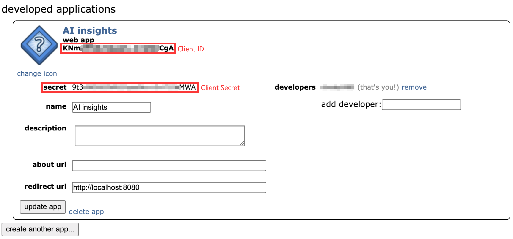
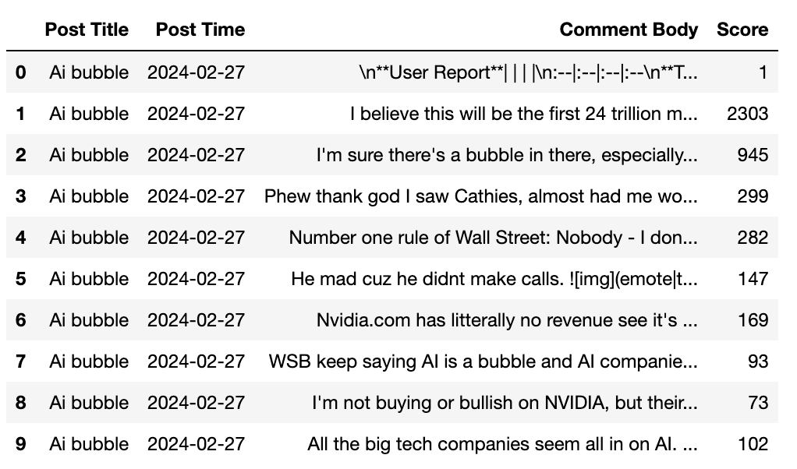

By Group "FINIX"

# Abstract

This is a post reporting our current process on collecting data from Reddit. In this stage, our objective is to collect enough data and store them into files for future analysis. During the collection process, we encountered several problems and give some possible solutions. 

## Data Collection

We are trying to gather data from Reddit. Generally, we are focusing on titles of posts and bodies of comments related to AI companies from the subreddit **"r/wallstreetbets"** .

> ​	**r/wallstreetbets**, also known as **WallStreetBets** or **WSB**, is a subreddit where participants discuss stocks and option trading. It has become notable for its colorful and profane jargon, aggressive trading strategies, and for playing a major role in the GameStop short squeeze that caused losses for some US firms and short sellers in a few days in early 2021.

 Reddit API allows us to retrieve update-to-date post and comment data. Prior to fetching the data, we need to create a Reddit account and then register an application to obtain API credentials (**client ID** and **client secret**) from [preferences (reddit.com)](https://www.reddit.com/prefs/apps). 




**PRAW** is used to access Reddit's API. It send HTTP requests to Reddit’s API endpoints, specifying the necessary parameters such as subreddit name, sort type, time range, etc., depending on the data we want to fetch.

These credentials are used to authenticate the requests. Below is the Python code for setting up our API autentication:

```wpython
import praw
import time
#initialize the identification
reddit = praw.Reddit(client_id='client id',
                     client_secret='client secret',
                     user_agent='define by ourselves. e.g. Steve')
```

We focus only on the comments rather than the posts. We will discuss the reasons behind that in the following parts. The information collected includes the 'title', 'score', 'created_utc','comments'. They each represents:

| attribute       | description                                                  |
| --------------- | ------------------------------------------------------------ |
| **title**       | The title of the post. This is the primary identifier of the post, usually summarizing its content or theme. |
| **score**       | The score of the post. This is the number of upvotes minus the number of downvotes the post has received. A higher score typically indicates content that the community members find more favorable or valuable. |
| **created_utc** | The UTC timestamp when the post was created. This timestamp indicates when the post was made on Reddit. This attribute can be used to understand the timeliness of the post or for analyzing the distribution of posts over time. |
| **comments**    | This attribute allows access to posts' comments.    |

To do this job, we write the following function. It searches the top 10 posts (by default) in *topic* from subreddit *subreddit_name* and get the first direct 20 comments from of the posts (i.e. no comments of comments here). 

```
def get_posts(subreddit_name, topic, limit=10, comment_limit=20):
    subreddit = reddit.subreddit(subreddit_name)
    posts = []
    for post in subreddit.search(topic,limit=limit):
        post_info = {
            'title': post.title,
            'score': post.score,
            'created_utc': post.created_utc,
            'comments': []
        }
        post.comments.replace_more(limit=0)  # Keep direct comments，drop comments of comments
        for comment in post.comments[:comment_limit]:  # Keep the top 20 comments of posts.
            comment_info = {
                'body': comment.body,
                'score': comment.score
            }
            post_info['comments'].append(comment_info)
        posts.append(post_info)
    return posts

```
 This is a sample code used to retrieve AI-related posts from *wallstreetbets* subreddit. The timestamp of raw data is in [*Unix time*](https://en.wikipedia.org/wiki/Unix_time) format. In order to better recognize the submission times of posts, we convert the *Unix* timestamp into human-redable [*UTC*](https://en.wikipedia.org/wiki/Coordinated_Universal_Time) timestamp. 
```
subreddit_name = 'wallstreetbets'
topic = 'AI'
posts = get_posts(subreddit_name,topic,limit =200000,comment_limit=50)

comments_data = [(post['title'], time.strftime('%Y-%m-%d', time.localtime(post['created_utc'])),comment['body'], comment['score']) 
                 for post in posts for comment in post['comments']]
df_comments = pd.DataFrame(comments_data, columns=['Post Title', 'Post Time', 'Comment Body', 'Score'])
```

Below is some of the data collected, we format it into the following dataframe structure. It is then  we storge Reddit data as *csv* files locally for future use. For those topics, we will collect data of both posts and the stock price.



In our project, we identify the following terms as topics. Both stock prices and Reddit data related to these topics will be futher collected.
- **AI related Company:** Microsoft, Google, NVIDIA, AMD...
- **AI Model:** ChatGPT, Gemini, Sora, Diffusion...
- **Index:** NSDQ


## Key Points To Note

#### 1. Choice of post contents

At the beginning, we tried to use both the **body text of both posts and comments** to analyze, but after we browse some posts, we found that many of them:

- **Too long:** some posts contains more than 10k words
- **Provide limited sentimental information:** some posts provide research data or news which are relatively neutral in sentiment
- **Only a picture/video in the post(meme):** which we cannot obtain any textual data from the posts

As such, we decide to use only post title to identify topics, and comment body of each post for the sentiment analysis.

#### 2. Choice of Subreddits

Originally, we plan to use AI companies' subreddits to search for data, such as NVIDIA, Google, etc. However, many posts in those subreddits are not all closely related to the stock. We believe those posts and comments can post bias when we analyze the stock market sentiment.

We decide to abort this idea and turn to "r/wallstreetbets", which consists tons of discussion on stock markets. Then, we choice the specific topics to collect posts and comments.


## Problems to be solved

#### 1. USELESS Comments

When fetching data via Reddit API, there are some unstructured comments that are irrelated to posts, like this: 
   > ```
   > '\n**User Report**| | | |\n:--|:--|:--|:--\n**Total Submissions** | 1 | **First Seen In WSB** | 5 months ago\n**Total Comments** | 40 | **Previous Best DD** | \n**Account Age** | 3 years | | \n\n[**Join WSB Discord**](http://discord.gg/wsbverse)'
   > ```
These appear to be garbage messages sent by robot, which could generate noise for our analysis. Thus we intend to use regular expression to filter the noisy data. 

#### 2. EMOJI
The emojis can better reflect the one's sentiment and attitude. However, the derived emojis appear in the following format, where we cannot extract any meaningful textual information. Another consideration is, the emotional meanings of emojis can vary depending on culture, context, and personal interpretation.

   > ```
   > '
   > ```

We may explore several methods to deal with emojis:
- Create a emoji map (use of regular expression) for mapping the Unicode emojis to the related emotion
- Use the python package **demoji** to remove emoji in comments